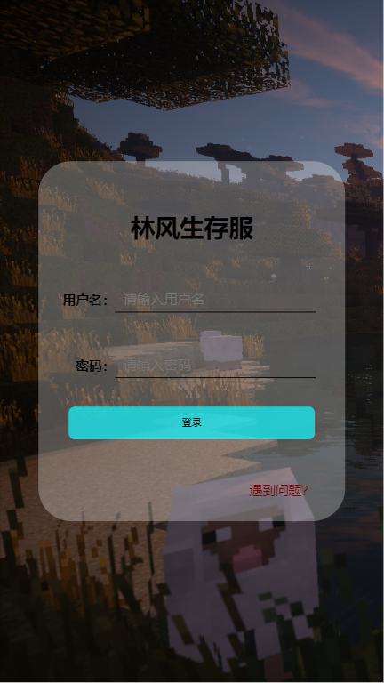
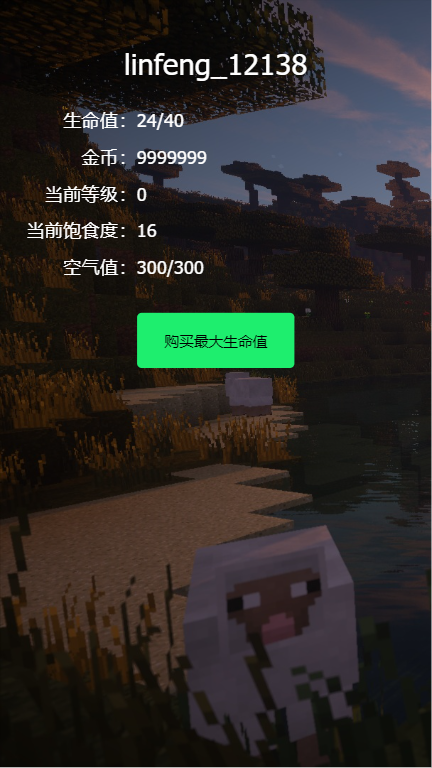

# mcWebAuth

本项目使用Java+vue2的一个允许玩家在手机页面查看自己游戏内数据信息的一个项目

## 使用前提

需要在服务端先加入一个webAuth的插件后才可以使用本项目。

否则无法实现登录功能

当然，若你能看懂源码，可以尝试自己编写webAuth插件，来实现自己的游戏内设置密码

## 思路

在游戏内使用命令来设置密码，也可以修改密码

而在web端无法设置和修改密码

所以推荐有正版验证的服务器使用

设置好密码后就可以在本项目中使用玩家id和密码登录了

## 游戏插件依赖

1. webAuth
2. MysqlPlayerDataBridge

## 食用方法

只需要在application.yml中修改数据库的用户名、密码和数据库名即可

## 效果截图

